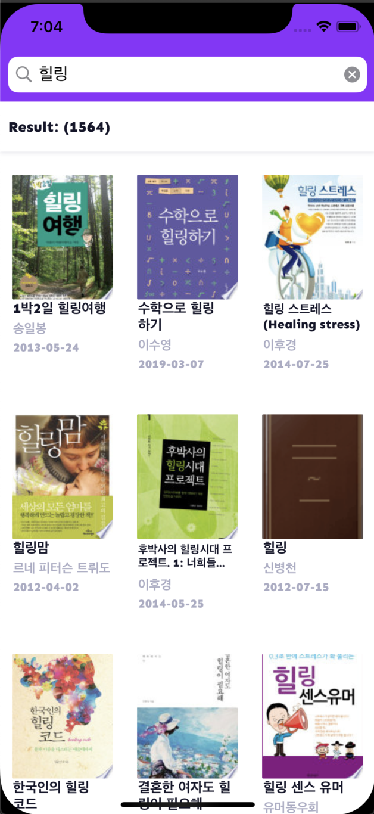
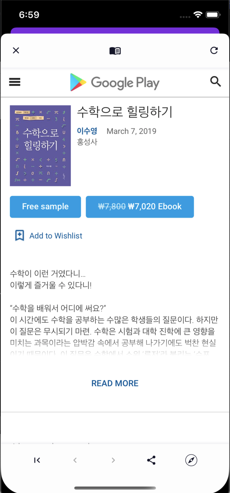

# Book Finder
책을 검색하고 책의 상세정보를 볼 수 있습니다.     
구글도서 API를 이용했습니다.
## 특징
아래 기술을 적용해보고 장단점을 알아보는 것이 프로젝트의 주요 목적입니다.
* Clean Architectue    
* TDD

## 화면구성



# 리뷰

clean architecture와 TDD를 적용해본 결과를 정리해봤습니다.

## Clean Architecture

1. **계층별 역할이 분명하여 관심사가 분리됩니다.**

안에서 바깥쪽 방향으로 레이어별로 예를 들어 설명해보겠습니다.

**entity layer**는 기업의 비지니스 룰을 담당하게 됩니다. 핵심업무 규칙이며 핵심 업무 데이터를 포하고 있습니다. 이 규칙과 데이터는 시스템으로 자동화하지 않은 경우에도 존재합니다. 그래서, 애플리케이션의 비지니스 룰을 구현해내는 기술과도 관련이 없습니다.  프론트엔드, 백엔드 등 상관없이 동일하게 적용될 수 있습니다.  마케터, 기획자, 디자이너 등등 다른 이해관계자도 동일하게 알고 있는 내용입니다.  

```swift
struct Book {
    private(set) var id: String
    private(set) var title: String
    private(set) var authors: [String]
    private(set) var publishedDate: Date?
    private(set) var thumbnailImage: URL?
    private(set) var detailInfo: URL?

    init(id: String? = nil, title: String? = nil, authors: [String]? = nil, publishedDate: Date? = nil, thumbnailImage: URL? = nil, detailInfo: URL? = nil) {
        self.id = id ?? ""
        self.title = title ?? ""
        self.authors = authors ?? []
        self.publishedDate = publishedDate
        self.thumbnailImage = thumbnailImage
        self.detailInfo = detailInfo
     }
}
```

> 좀 더 룰이 복잡해지면 내부 데이터를 사용하는 method가  추가될 것입니다.

**use case layer**는 앱의 비지니스 룰을 담당합니다. 

이 layer에서 interactor는 어떤 이벤트와 정보를 받을지 정의하고, 어떤 일이 일어나기를 원하는지를 정합니다. 구현 방식은 알고 싶어하지 않기 때문에 protocol로 정의하고, 하위레이어가 이를 호출하거나 구현 하기를 원합니다.

예를 들어,  BookIndexInteractor는  이 레이어에서 정의한 BookIndexInputBoundary를  따름으로써 하위레이어가 전달하는 이벤트와 정보를 받게 됩니다. 

```swift
protocol BookIndexInputBoundary: class {
    init(outputBoundary: BookIndexOutputBoundary, repository: IBookSummaryRepository)
    func viewIsReady(columnCount: Int)
    func didSelectSeeingMore()
    func didRetryOnSeeingMore()
    func didSelectBook(index: Int)
    func didSelectKeywordSearch(_ keyword: String)
    func didEndEditingSearchKeyword()
}
```

하위 레이어의  BookIndexViewController가  BookIndexInputBoundary 타입의 객체를 소유하고 있습니다. 

```swift
class BookIndexViewController: UIViewController {

    private var inputBoundary: BookIndexInputBoundary
        ...
}
```

그리고, 유저 액션이 발생하면 적절한 메쏘드를 호출하여  interactor에게 알립니다.

```swift
func collectionView(_ collectionView: UICollectionView, willDisplaySupplementaryView view: UICollectionReusableView, forElementKind elementKind: String, at indexPath: IndexPath) {
    if elementKind == UICollectionView.elementKindSectionFooter {
        if moreRetryVisible == false {
            inputBoundary.didSelectSeeingMore()
         }
     }
}
```

interactor는 이벤트의 처리 과정에서 다른 객체에게 협력을 요청합니다. 구현 세부사항은 하위의 interface adapter layer가 담당합니다. 그래서,  BookIndexOutputBoundary를 BookIndexPresenter가 구현하고, IBookSummaryRepository는 BookSummaryRepository 가 구현합니다.  

```swift
protocol BookIndexOutputBoundary: class {
    func showBooks(_ productList: [BookSummary])
    func showBookDetail(id: String, detailInfoUrl: URL?)
    func showSearchKeyword(_ keyword: String)
    func showTotalCount(_ count: Int)
    func alertErrorMessage(_ message: String)
    func showLoadingIndicator()
    func hideLoadingIndicator()
    func activateRetryOnSeeingMore()
    func deactivateRetryOnSeeingMore()
    func scrollToTop()
}

protocol IBookSummaryRepository {
    func fetchBooks(page: Int, keyword: String, maxResultCount: Int, completion: ((Result<(books: [Book],totalCount: Int),RepositoryError>) -> Void)?)
}
```

아래와 같이 interactor는  didSelectSeeingMore() 가 호출됐을 때 repository에게 데이터를 요청한 후 결과에 따라 outputBoundary에게 필요한 정보를 제공하면서 행위를 위임합니다. 

```swift
func didSelectSeeingMore() {
    loadBooksMore()
}

private func loadBooksMore() {
    repository.fetchBooks(page: state.page + 1, keyword: state.keyword, maxResultCount: maxResultCount){[weak self](result) in
            guard let self = self else { return }
            switch(result) {
            case let .success(data):
                self.state.page = self.state.page + 1
                self.state.products += data.books
                self.outputBoundary?.showBooks(self.state.products.map{ BookSummary(from: $0) })
                self.state.totalCount = data.totalCount
                self.outputBoundary?.showTotalCount(self.state.totalCount)
            case let .failure(error):
                self.outputBoundary?.activateRetryOnSeeingMore()
                self.outputBoundary?.alertErrorMessage(error.localizedDescription)
            }
        }
    }
}
```

**interface adapter layer**는 프레임워크와 내부 레이어를 분리시켜줍니다. 

이 layer는 framework&driver layer의 driver에게 구현해야할 protocol을 제시합니다. 

예를 들어,  BookIndexPresenter에서 사용하기 위해 BookIndexViewControllable를 정의하고 하위레이어가 구현하게 합니다. 

```swift
protocol BookIndexViewControllable: class {
    func showBooks(_ products: [BookIndexItemViewData])
    func showBookDetail(id: String, detailInfoUrl: URL?)
    func showSearchKeyword(_ keyword: String)
    func showTotalCount(_ count: String)
    func alertErrorMessage(title: String, message: String, buttonTitle: String)
    func deactivateRetryOnSeeingMore()
    func activateRetryOnSeeingMore()
    func showLoadingIndicator()
    func hideLoadingIndicator()
    func scrollToTop()
}
```

BookIndexPresenter는 BookIndexViewControllable 타입의 객체를 참조하고 필요할 때 메쏘드를 호출합니다. 그리고,  데이터는 뷰에서 바로 표시할 수 있는 형태로 맵핑 후 전달합니다. 이제 뷰에 표시할 데이터의 형태를 바꾸기 위해서는 presenter를 수정하면 됩니다.  뷰의 레이아웃이나 속성이 변경이 된다면 뷰만 수정하면 됩니다.  

```swift
class BookIndexPresenter {
    private weak var view: BookIndexViewControllable?
}

extension BookIndexPresenter: BookIndexOutputBoundary {
    
    func showBooks(_ productList: [BookSummary]) {
        
        view?.showBooks(productList.map{
            let displayedDate = $0.publishedDate?.string(format: "yyyy-MM-dd") ?? ""
            var displayedAuthors = $0.authors.first ?? ""
            if $0.authors.count >= 2 {
                displayedAuthors += "외 \($0.authors.count)명"
            }
            return BookIndexItemViewData(id: $0.id, thumbnailUrl: $0.thumbnailImage, title: $0.title, author: displayedAuthors, publishedDate: displayedDate)
        })
    }
}

struct BookIndexItemViewData {
    private(set) var id: String
    private(set) var thumbnailUrl: URL?
    private(set) var title: String
    private(set) var author: String
    private(set) var publishedDate: String
}

```

다른 예로, 네트워킹 서비스를 구현하기 위해서  NetworkingServiceAvailable을  정의하고 BookSummaryRepository에서 사용합니다. 

NetworkingServiceAvailable은 framework & driver layer에서 NetworkingService 가 구현하고 있습니다. 

use case layer의 IBookSummaryRepository에서는 repository가 구체적으로 어떤 기술을 쓰는지는 정의하지 않고 있습니다.  BookSummaryRepository만 네트워크 서비스를 사용하는 것을 알고 있습니다. 따라서, 데이터베이스 등 다른 서비스로 변경을 하는 경우 use case layer는 변경할 필요가 없습니다. 

```swift
protocol NetworkingServiceAvailable {
     func request(_ api: ServerAPI, parameters: [String: Any]?) -> IDataRequest?
}

class BookSummaryRepository: IBookSummaryRepository {
        
    private let networking: NetworkingServiceAvailable
    
    required init(networking: NetworkingServiceAvailable) {
        self.networking = networking
    }
    
    func fetchBooks(page: Int, keyword: String, maxResultCount:Int, completion: ((Result<(books: [Book], totalCount: Int), RepositoryError>) -> Void)?) {
        let params = makeParams(page, keyword, maxResultCount)
        networking.request(.books, parameters: params)?
            .response{(result :Result<BookIndexAPIModel, ServerAPIResponseError>) in
                DispatchQueue.main.async {
                    switch(result) {
                    case .success(let data):
                        if data.isEmpty() {
                            completion?(.failure(RepositoryError(kind: .emptySearchResult(keyword: keyword))))
                        } else {
                            completion?(.success((books: data.toBooks(), totalCount: data.totalItems ?? 0)))
                        }
                    case .failure(let error):
                         completion?(.failure(error.toRepositoryError()))
                }
            }
        }
    }

    ...
}
```

**framework & driver layer**에는 UIKit, Alamofire 등의 라이브러리와 이러한 라이브러리를 사용하는 driver가 있습니다.

> Clean Architecture에서,  아키텍처가 "시스템이 프레임워크 독립성을 가지게" 만들어야 한다고 말하고 있습니다. - 아키텍처는 ...라이브러리를 제공하는 소프트웨어, 즉, 프레임워크의 존재여부에 의존하지 않는다. ....프레임워크를 도구로 사용할 수 있으며, 프레임워크가 지닌 제약사항안으로 시스템을 욱여 넣도록 강제하지 않는다 (p214) -  그러나, 프레임워크가 애플리케이션의 흐름을 직접 제어할 수 있다고 보는 측면이 있기 때문에, 여기서 말하는 프레임워크를 일반적인 라이브러리라고 봤을때 헤깔리지 않았습니다.

예를 들어,  BookIndexViewController는 뷰를 제공하기 위해 UIKit을 사용하며,  NetworkingService 는 RestAPI를 호출하기 위해 Alamofire를 사용합니다. 이들은 interface adapter layer에서 정의한 protocol을 구현하는 방식으로 앱에게 서비스를 제공합니다. 따라서, 앱이 정말 필요로하는 기능을 구현하게 되고, 앱이 라이브러리의 구현방식에 종속되지 않게 해줍니다.         

2. **요구사항 변경에 안정적입니다.** 

**밖에서 안으로 향하는 단방향의 컴파일 타임 의존성의 의미**

상위 레이어의 변경은 하위 레이이어에 영향을 미칩니다.

하지만, 하위 레이어의 변경은 상위 레이어에 영향을 미치지 않습니다. 

domain에 변경사항이 생기면, 모든 레이어가 변경이 됩니다. 

기능이 변경되면 use case, interface adapter, driver가 함께 수정이 됩니다.

뷰의 레이아웃 또는 속성이 변경이 되면 view만 수정하면 됩니다. 

레이어의 역할을 살펴보면 안쪽으로 고수준 정책이 배치됩니다. 고수준 정책일수록 변경될 가능성은 낮습니다. 내부 레이어가 변경될수록 수정의 범위는 넓어지지만, 변경될 가능성이 낮습니다. 외부 레이어일수록 더 자주 변경되지만,  이 때 내부 레이어는 변경되지 않습니다.  따라서, 이 구조는 변화에 안정적입니다.      
      
3. **라이브러리의 교체를 쉽게 만들어줍니다.** 

interface adapter layer에서는 앱이 정말 필요로하는 기능에 대한 protocol을 정의하고 driver가 이를 구현합니다. 라이브러리를 교체해야한다면 이 프로토콜의 구현부만 교체해주면 됩니다!

예를 들어,  지도 라이브러리가 변경되었다고 가정해봅시다. 만약 뷰에서 직접 라이브러리를 사용하고 있었다면 지도를 사용하는 화면 수만큼 코드를 변경해야 할 것입니다. 

반면, 지도 라이브러리를 driver만 직접 접근하게 만들면 driver만 수정하면 됩니다. 지도 관련 앱의 비지니스 룰이 전혀 달라지지 않았기 때문에 interface adapter layer에서 정의한  protocol의 목록은 변함이 없을 것입니다.

뷰는 (지도의 특성상) 지도 뷰를 전달받아서 addSubview()를 하고 오토레이아웃으로 배치해주는 정도만 담당하면 됩니다. 

interactor는 repository, map service 및 필요하다면 geocoder, my location service 등과 협력하면서 use case를 구현해놓은 상태일 것입니다. 여기는 라이브러리가 교체되는데 전혀 영향을 받지 않습니다.

만약 뷰에서 지도 라이브러리만이 아니라, 앱의 비지니스 룰, RestAPI호출까지 담당하고 있었다면 이런 코드 중에서 라이브러리 사용하는 부분만 찾아서 수정해야하는 부담이 생길 것입니다.        

4. **외부에서 전달받은 데이터에 앱 전체가 엮이지 않게 해줍니다.**  

쇼핑몰 앱에서 상품정보를 가져오는 화면이 여러 개 있다고 가정해봅시다.  상품정보를 표시하는 뷰에서 RestAPI를 호출하고 응답으로 받은 JSON 의 구조를 그대로 가진 데이터 객체를 사용하는 상황입니다. 

그런데, 그 화면들은 시간차를 두고 개발이 되었고, 그 때마다 서버 개발자가 달라지면서 API 응답의 Json 구조가 달라졌습니다.  productName, itemName 식으로 상품명을  다르게 붙인다던가, price의 타입이 Int, String 두가지라던가... 이제,  해당 화면들을 수정할 때마다 늘 서로 다른 데이터 타입을 다뤄야합니다.  

여기에 더해서 더 문제가 되는 상황을 가정해보겠습니다. 백엔드단에서 Rest API 전체를 재정비하기로 했습니다.  통일되지 못했던 기존 API를 갈아엎고  API간 공통 모델을 사용하기로 했고, API 목록도 달라지고....아무튼 프론트엔드에서 어떻게 사용하고 있는지는 신경쓰지 않고 시원하게 바꾸고 싶은 상황입니다.  그런데,  프론트엔드에서는 애플리케이션  전체적으로 API 응답 구조를 그대로 사용하고 있기 때문에 API 변화에 대한 영향범위도 앱 전체가 되었습니다. 

하지만, API 응답 구조를 그 데이터를 가져오는 repository만 알게한다면  API 변경의 영향 범위는 repository로 제한이 됩니다!  API를 변경한다고 해도 도메인, usecase나 뷰의 로직은 달라지지 않기 때문입니다.

이제 앱 내에서 사용하는 모든 API가 바뀐다고 하면 모든 repository만 변경해주면 됩니다. 

예제 프로젝트에서 repository는  interactor에게 data를 넘길때 use case가 원하는 형태로 맵핑하여 전달합니다.

`completion?(.success((books: data.toBooks(), totalCount: data.totalItems ?? 0)))`

위의 실행문에서`toBooks()` 가 BookIndexAPIModel을 Book 엔티티로 변환합니다. 

```swift
class BookSummaryRepository: IBookSummaryRepository {
        
    ...

    func fetchBooks(page: Int, keyword: String, maxResultCount:Int, completion: ((Result<(books: [Book], totalCount: Int), RepositoryError>) -> Void)?) {
        let params = makeParams(page, keyword, maxResultCount)
        networking.request(.books, parameters: params)?
            .response{(result :Result<BookIndexAPIModel, ServerAPIResponseError>) in
                DispatchQueue.main.async {
                    switch(result) {
                    case .success(let data):
                        if data.isEmpty() {
                            completion?(.failure(RepositoryError(kind: .emptySearchResult(keyword: keyword))))
                        } else {
                            completion?(.success((books: data.toBooks(), totalCount: data.totalItems ?? 0)))
                        }
                    case .failure(let error):
                         completion?(.failure(error.toRepositoryError()))
                }
            }
        }
    }

}


// MARK: - APIModel

struct BookIndexAPIModel: IServerAPIModel {
 ...
}

extension BookIndexAPIModel {
    
    func toBooks() -> [Book] {
        guard let items = items, isValid() else { return [] }
        return items.map{
            let thumbnailUrl = URL(string: $0.volumeInfo?.imageLinks?.smallThumbnail ?? "")
            let detailUrl = URL(string: $0.volumeInfo?.infoLink ?? "")
            var date = Date(from: $0.volumeInfo?.publishedDate, format: "yyyy-MM-dd")
            if date == nil {
                date = Date(from: $0.volumeInfo?.publishedDate, format: "yyyy")
            }
            return Book(id: $0.id, title: $0.volumeInfo?.title, authors: $0.volumeInfo?.authors, publishedDate: date, thumbnailImage: thumbnailUrl, detailInfo: detailUrl)
        }
    }
}
```

> 맵핑하는 로직이 여러 use case에서 중복될 수 있기 때문에 맵핑만을 담당하는 객체와 협력해야하는 시점이 올 것입니다.


**외부에서 전달되는 모든 데이터는 직접 사용하지 않고, 앱의 entity로 변환하는 것이 외부 변화로부터 앱의 영향범위를 최소화할 수 있습니다.**       


5. **내부 레이어의 분리가 가능합니다.**      

레이어간에 DIP 를 적용함으로써 안쪽레이어가 바깥쪽 레이어를 컴파일 타임에 의존하지 않도록 했기 때문에  안쪽 레이어는 밖의 레이어가 없어도 컴파일이 가능합니다.  

entities는 그 자체 만으로 컴파일이 가능하고,  use cases는  entities만 있다면 컴파일이 가능합니다. 

그래서,  내부 레이어를  별도의 프레임워크로 분리해낼 수 있고, 다른 프로젝트와 공용 또는 재사용이 가능하다는 의미이기도 합니다.

기업의 서비스를 개발하다보면 도메인을 공유하는 또다른 앱을 만들어야 하는 경우가 생깁니다. entity와  use case가 동일하고, view 만 다르다면 UI만 변경하면 됩니다. entity만 동일하다면 use case  와 UI를 변경하면 됩니다.        

6. **소스파일의 계층구조를 관리하기가 더 편합니다.**

앱이 커질 수록 모듈은 점차 증가합니다.  새로운 타입을 어느 파일을 넣어야하고, 파일은 어느 디렉토리에 포함시켜야하며, 디렉토리 분류는 어떻게 해야할지 고민이 됩니다. 

디렉토리를 레이어별로 분리를 하게 되면 새로운 타입은 우선 레이어들 중 하나에 놓이게 될 것입니다.

그 타입은 대부분 해당 레이어에서만 사용될 것입니다.  그래서, 요구사항 변경 시  검토해야할 소스의 범위를 레이어로 한정시킬 수 있습니다.

앱이 복잡해지면서 각 레이어의 요소들간에 공통으로 사용하는 타입이 늘어나게 될텐데, 그 경우는 확실하게 해당 레이어에서만 사용하기 때문에 다른 레이어에서는 이 타입에 대해서 알 필요가 없습니다.   

# To be contined

클린 아키텍처가 MVVM같은 다른 디자인 패턴과 잘 섞일 것이라는 가정을 하고있는데,이를 확인해보려고 합니다

또한, ReactorKit이나 RIBs같은 프레임워크와도 공존할 수 있는지도 확인해볼 예정입니다. 

그리고, 클린아키텍처의 단점과 TDD에 대해서도 정리해보겠습니다.      

> 의문점이 있다면 언제든지 얘기해주세요. 함께 보완해나가고 싶습니다.
